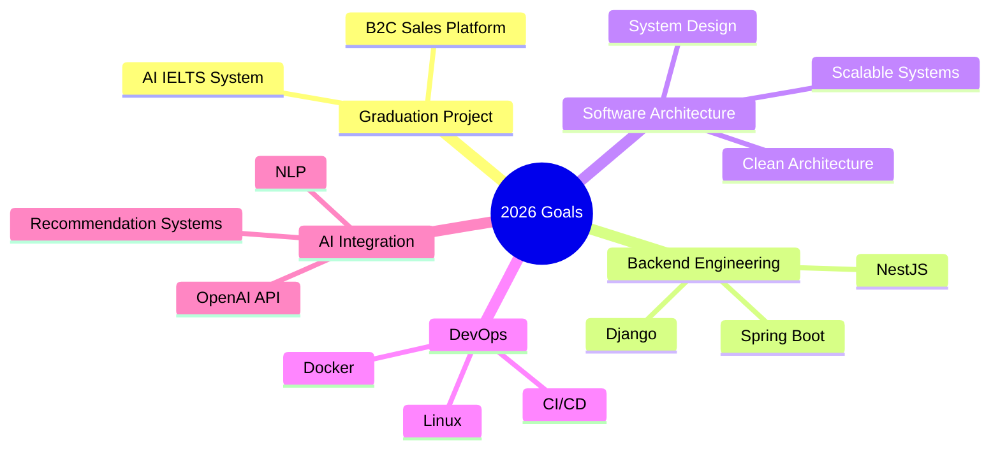

# README.md

<h1 align="center">
  
</h1>

<div align="center">
  
</div>


<div align="center">
  <a href="https://github.com/hoangtuanphong1a" target="_blank">
    
  </a>
  <a href="#" target="_blank">
    
  </a>
  <a href="mailto:your.email@example.com">
    
  </a>
</div>

<br/>

<div align="center">
  
  
</div>

---

## 🚀 About Me

```javascript
const phong = {
  role: "Software Developer",
  location: "Vietnam 🇻🇳",

  education: "Final-year Information Technology Student",

  currentProjects: [
    "B2C Sales Platform",
    "AI-powered IELTS Learning System",
    "Public Vehicle Rental System",
    "Document Intelligence Platform"
  ],

  specialization: [
    "Backend Development",
    "Full-stack Development",
    "System Design",
    "RESTful API Design",
    "AI Integration"
  ],

  backend: [
    "Node.js",
    "NestJS",
    "Spring Boot",
    "Django",
    "ExpressJS"
  ],

  frontend: [
    "ReactJS",
    "NextJS",
    "TypeScript",
    "TailwindCSS",
    "Bootstrap"
  ],

  databases: [
    "MySQL",
    "PostgreSQL",
    "MongoDB",
    "SQL Server"
  ],

  devOps: [
    "Docker",
    "Docker Compose",
    "GitHub Actions",
    "CI/CD",
    "Linux"
  ],

  ai: [
    "OpenAI API",
    "Prompt Engineering",
    "NLP",
    "Recommendation Systems"
  ],

  mindset: [
    "Build Real Projects",
    "Write Clean Code",
    "Solve Real Problems",
    "Never Stop Learning"
  ]
};
```

## 💻 Tech Stack

### 💻 Programming Languages


### 🎨 Frontend


### 🔧 Backend


### 🗄️ Databases


### 🚀 DevOps & Tools


## 📊 GitHub Statistics

<div align="center">
  
  
</div>

## 🎯 Current Focus



## 📈 Contribution Graph

[](https://github.com/ashutosh00710/github-readme-activity-graph)

## 🏆 Achievements

* 🎓 Final-year Information Technology Student
* 🚀 Building Real-world Full-stack Applications
* 🤖 Developing AI-integrated Systems
* 🐳 Experience with Docker & CI/CD
* 📚 Passionate about Software Architecture & System Design

## 🏆 Featured Projects

> Replace the repository names below with your actual repositories.

* 🚗 Public Vehicle Rental System
* 🤖 AI-powered IELTS Learning Platform
* 🛒 B2C Sales Platform
* 📄 Document Intelligence Platform

<div align="center">
  
</div>

<div align="center">
  
</div>

<div align="center">
  
</div>
