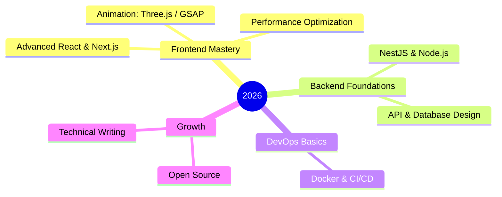

<!-- ============================ GREETING ============================ -->
<h1 align="center">
  
</h1>

<div align="center">
  
</div>

<!-- ============================ BANNER 1 (your own image) ============================ -->
<p align="center">
  
</p>

<!-- ============================ SOCIALS ============================ -->
<div align="center">
  <a href="https://github.com/hoangtuanphong1a" target="_blank">
    
  </a>
  <a href="https://linkedin.com/in/yourprofile" target="_blank">
    
  </a>
  <a href="https://dev.to/yourprofile" target="_blank">
    
  </a>
  <a href="mailto:your.email@example.com">
    
  </a>
</div>

<div align="center">
  
  
</div>

<br/>

<!-- ============================ ABOUT ============================ -->
## 👨‍💻 About Me

- 🎓 Final-year IT student, focused on **Frontend Development** with React &amp; Next.js
- 🤖 Building **AI-integrated systems** — chatbots, NLP, and personalized learning tools
- 🌱 Currently sharpening **clean code, performance optimization, and system design**
- 💬 Ask me about **React, TypeScript, NestJS, or Docker**

```typescript
const phong = {
  role: "Frontend Developer",
  location: "Vietnam 🇻🇳",
  building: ["B2C platform w/ AI chatbot", "AI-powered IELTS learning system"],
  mindset: "Learn by shipping real projects.",
};
```

<!-- ============================ BANNER 2 (your own image) ============================ -->
<p align="center">
  
</p>

<!-- ============================ TECH STACK ============================ -->
## 🛠️ Tech Stack

**Languages**


**Frontend**


**Backend &amp; DevOps**


**Databases &amp; Cloud**


**Tools**


<!-- ============================ STATS ============================ -->
## 📊 GitHub Stats

<div align="center">
  
  
</div>

<div align="center">
  
</div>

<!-- ============================ GOALS ============================ -->
## 🎯 2026 Goals



<!-- ============================ PROJECTS ============================ -->
## 🏆 Featured Projects

<div align="center">
  <a href="https://github.com/hoangtuanphong1a/project1">
    
  </a>
  <a href="https://github.com/hoangtuanphong1a/project2">
    
  </a>
</div>

<!-- ============================ SNAKE ============================ -->
<div align="center">
  
</div>

<!-- ============================ FOOTER ============================ -->
<div align="center">
  
</div>
