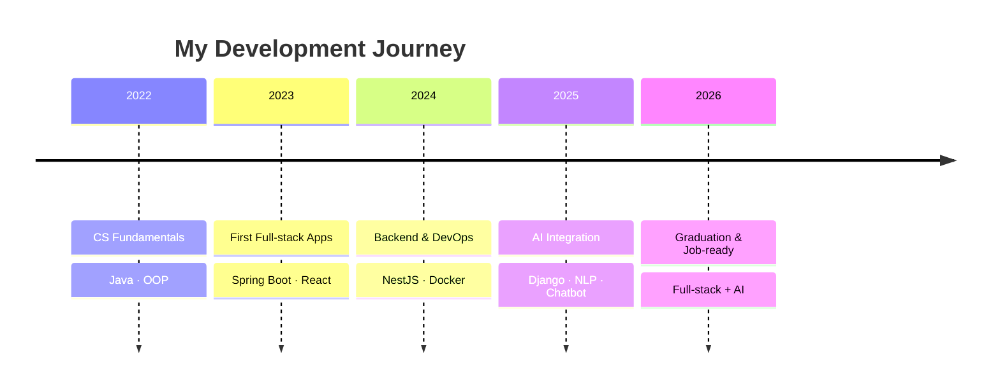
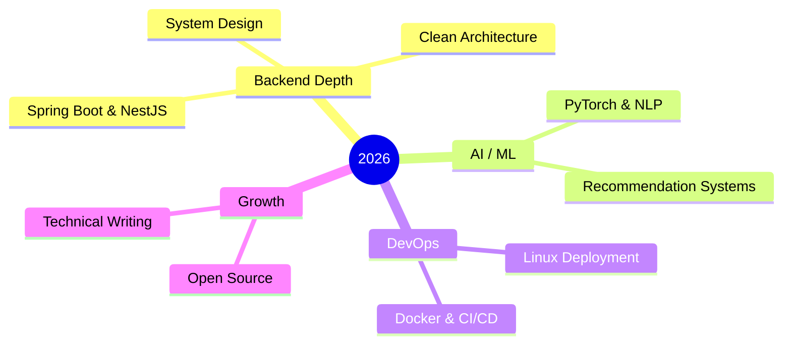

<!-- ============================ GREETING ============================ -->
<h1 align="center">
  
</h1>

<div align="center">
  
</div>

<!-- ============================ GLOBE HERO (GIF) ============================ -->
<p align="center">
  
</p>

<!-- ============================ SOCIALS ============================ -->
<div align="center">
  <a href="https://github.com/hoangtuanphong1a" target="_blank">
    
  </a>
  <a href="https://linkedin.com/in/yourprofile" target="_blank">
    
  </a>
  <a href="https://dev.to/yourprofile" target="_blank">
    
  </a>
  <a href="mailto:hoangtuanphong1a@gmail.com">
    
  </a>
</div>

<div align="center">
  
  
</div>

<br/>

<!-- ============================ ABOUT ============================ -->
## 👨‍💻 About Me

- 🎓 Final-year IT student, heading toward **Software Developer (Full-stack &amp; AI)**
- 🧩 Shipped projects with **Spring Boot, NestJS, Django, ReactJS &amp; Flutter**
- 🤖 Into **AI integration** — chatbots, recommendation systems &amp; NLP
- 🌱 Currently sharpening **clean architecture, system design &amp; deployment**
- 💬 Ask me about **Backend, React, Docker, Firebase, or AI integration**

```typescript
const phong = {
  role: "Software Developer",
  location: "Vietnam 🇻🇳",
  focus: ["Full-stack Web", "AI Integration", "Software Project Management"],
  stack: ["Spring Boot", "NestJS", "Django", "React", "Flutter"],
  building: ["B2C platform w/ AI chatbot", "AI-powered IELTS learning system"],
  mindset: "Learn by shipping real projects.",
};
```

<!-- ============================ BANNER (your own image) ============================ -->
<p align="center">
  
</p>

<!-- ============================ TECH STACK (bento cards) ============================ -->
## 🛠️ Tech Stack

<table>
  <tr>
    <td width="50%" valign="top" align="center">
      <h3>💻 Languages</h3>
      
      
      
      
      
      
      
    </td>
    <td width="50%" valign="top" align="center">
      <h3>⚙️ Backend</h3>
      
      
      
      
      
      
      
    </td>
  </tr>
  <tr>
    <td width="50%" valign="top" align="center">
      <h3>🎨 Frontend</h3>
      
      
      
      
      
    </td>
    <td width="50%" valign="top" align="center">
      <h3>📱 Mobile</h3>
      
      
      
    </td>
  </tr>
  <tr>
    <td width="50%" valign="top" align="center">
      <h3>🗄️ Database</h3>
      
      
      
      
    </td>
    <td width="50%" valign="top" align="center">
      <h3>🤖 AI / ML</h3>
      
      
      
      
      
    </td>
  </tr>
  <tr>
    <td width="50%" valign="top" align="center">
      <h3>🚀 DevOps &amp; Cloud</h3>
      
      
      
      
      
      
    </td>
    <td width="50%" valign="top" align="center">
      <h3>🧰 Tools</h3>
      
      
      
      
      
      
    </td>
  </tr>
</table>

<!-- ============================ DASHBOARD ============================ -->
## 📊 Software Engineering Dashboard

<div align="center">
  
  
</div>

<!-- ============================ TOP LANGUAGES ============================ -->
## 💻 Top Languages

<div align="center">
  
  
</div>

<!-- ============================ TROPHIES ============================ -->
## 🏆 GitHub Trophies

<div align="center">
  
</div>

<!-- ============================ ENGINEERING PRINCIPLES ============================ -->
## ⚙️ Engineering Principles

> 🧼 **Clean over clever** — readable code beats clever one-liners.
>
> 🧩 **Design before code** — model the data and the flow first.
>
> 🚢 **Ship &amp; iterate** — small commits, fast feedback loops.
>
> 🔍 **Own the bug** — reproduce it, fix the root cause, add a guard.
>
> 📚 **Learn in public** — document, share, keep improving.

<!-- ============================ DEVELOPMENT JOURNEY ============================ -->
## 🧭 Development Journey



<!-- ============================ PROJECTS ============================ -->
## 🚀 Featured Projects

<table>
  <tr>
    <td width="50%" valign="top">
      <h3>🛒 B2C Sales Platform + AI Chatbot</h3>
      <p>Full-stack e-commerce với chatbot AI tư vấn &amp; hỗ trợ khách hàng tự động.</p>
      <p>
        
        
        
        
      </p>
    </td>
    <td width="50%" valign="top">
      <h3>📘 IELTS AI Learning System</h3>
      <p>Nền tảng luyện thi IELTS cá nhân hóa bằng AI/NLP theo từng người học.</p>
      <p>
        
        
        
        
      </p>
    </td>
  </tr>
  <tr>
    <td width="50%" valign="top">
      <h3>✅ Task Management System</h3>
      <p>Quản lý công việc: task CRUD, checklist, attachment, deadline, priority &amp; gán thành viên.</p>
      <p>
        
        
      </p>
    </td>
    <td width="50%" valign="top">
      <h3>☕ Coffee Shop Management</h3>
      <p>Hệ thống quản lý quán: đăng nhập, quản lý bàn, người dùng &amp; phân quyền.</p>
      <p>
        
        
        
        
      </p>
    </td>
  </tr>
  <tr>
    <td width="50%" valign="top">
      <h3>📱 Facebook Clone (Flutter)</h3>
      <p>Social app: post, story, like, comment, notification &amp; birthday events.</p>
      <p>
        
        
      </p>
    </td>
    <td width="50%" valign="top">
      <h3>💪 Current Strengths</h3>
      <p>
        ✅ Full-stack Web (Spring Boot · NestJS · Django)<br/>
        ✅ React Frontend &amp; Database Design<br/>
        ✅ Docker &amp; Deployment · Firebase<br/>
        ✅ AI Integration · Agile Workflow
      </p>
    </td>
  </tr>
</table>

<!-- ============================ GOALS ============================ -->
## 🎯 2026 Goals



<!-- ============================ FOOTER ============================ -->
<div align="center">
  
</div>
