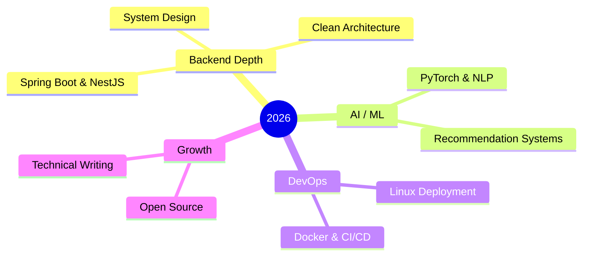

<!-- ============================ GREETING ============================ -->
<h1 align="center">
  
</h1>

<div align="center">
  
</div>

<!-- ============================ GLOBE HERO (GIF) ============================ -->
<!-- 👉 Cách lấy link: lên GitHub → mở 1 Issue mới → kéo-thả file globe-network.gif vào ô comment
     → GitHub tạo link dạng https://github.com/user-attachments/assets/... → dán link đó vào src bên dưới -->
<p align="center">
  
</p>

<!-- ============================ SOCIALS ============================ -->
<div align="center">
  <a href="https://github.com/hoangtuanphong1a" target="_blank">
    
  </a>
  <a href="https://linkedin.com/in/yourprofile" target="_blank">
    
  </a>
  <a href="https://dev.to/yourprofile" target="_blank">
    
  </a>
  <a href="mailto:your.email@example.com">
    
  </a>
</div>

<div align="center">
  
  
</div>

<br/>

<!-- ============================ ABOUT ============================ -->
## 👨‍💻 About Me

- 🎓 Final-year IT student, heading toward **Software Developer (Full-stack &amp; AI)**
- 🧩 Shipped projects with **Spring Boot, NestJS, Django, ReactJS &amp; Flutter**
- 🤖 Into **AI integration** — chatbots, recommendation systems &amp; NLP
- 🌱 Currently sharpening **clean architecture, system design &amp; deployment**
- 💬 Ask me about **Backend, React, Docker, or AI integration**

```typescript
const phong = {
  role: "Software Developer",
  location: "Vietnam 🇻🇳",
  stack: ["Spring Boot", "NestJS", "Django", "React", "Flutter"],
  building: ["B2C platform w/ AI chatbot", "AI-powered IELTS learning system"],
  mindset: "Learn by shipping real projects.",
};
```

<!-- ============================ BANNER (your own image) ============================ -->
<p align="center">
  
</p>

<!-- ============================ TECH STACK ============================ -->
## 🛠️ Tech Stack

<table>
  <tr>
    <td align="right"><b>Languages</b></td>
    <td>
      
      
      
      
      
      
    </td>
  </tr>
  <tr>
    <td align="right"><b>Backend</b></td>
    <td>
      
      
      
      
      
      
    </td>
  </tr>
  <tr>
    <td align="right"><b>Frontend</b></td>
    <td>
      
      
      
      
    </td>
  </tr>
  <tr>
    <td align="right"><b>Mobile</b></td>
    <td>
      
      
    </td>
  </tr>
  <tr>
    <td align="right"><b>Database</b></td>
    <td>
      
      
    </td>
  </tr>
  <tr>
    <td align="right"><b>AI / ML</b></td>
    <td>
      
      
      
    </td>
  </tr>
  <tr>
    <td align="right"><b>DevOps</b></td>
    <td>
      
      
      
      
    </td>
  </tr>
  <tr>
    <td align="right"><b>Tools</b></td>
    <td>
      
      
      
      
      
      
    </td>
  </tr>
</table>

<!-- ============================ STATS ============================ -->
## 📊 GitHub Stats

<div align="center">
  
  
</div>

<div align="center">
  
</div>

<!-- ============================ PROJECTS ============================ -->
## 🏆 Featured Projects

<table>
  <tr>
    <td width="50%" valign="top">
      <h3>🛒 B2C Sales Platform + AI Chatbot</h3>
      <p>Full-stack e-commerce với chatbot AI tư vấn &amp; hỗ trợ khách hàng tự động.</p>
      <p>
        
        
        
        
      </p>
    </td>
    <td width="50%" valign="top">
      <h3>📘 IELTS AI Learning System</h3>
      <p>Nền tảng luyện thi IELTS cá nhân hóa bằng AI/NLP theo từng người học.</p>
      <p>
        
        
        
        
      </p>
    </td>
  </tr>
  <tr>
    <td width="50%" valign="top">
      <h3>✅ Task Management System</h3>
      <p>Quản lý công việc: CRUD task, checklist, deadline, phân quyền &amp; gán thành viên.</p>
      <p>
        
        
      </p>
    </td>
    <td width="50%" valign="top">
      <h3>☕ Coffee Shop Management</h3>
      <p>Hệ thống quản lý quán: đăng nhập, quản lý bàn, người dùng &amp; phân quyền.</p>
      <p>
        
        
        
        
      </p>
    </td>
  </tr>
</table>

<!-- ============================ GOALS ============================ -->
## 🎯 2026 Goals



<!-- ============================ SNAKE ============================ -->
<div align="center">
  
</div>

<!-- ============================ FOOTER ============================ -->
<div align="center">
  
</div>
