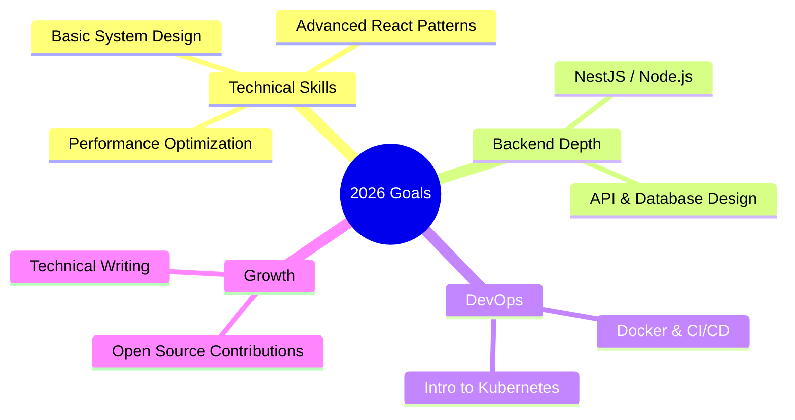

<!-- ========================= HEADER BANNER ========================= -->


<div align="center">
  
</div>

<!-- ========================= SOCIALS + COUNTERS ========================= -->
<div align="center">
  <a href="https://github.com/hoangtuanphong1a" target="_blank">
    
  </a>
  <a href="https://linkedin.com/in/yourprofile" target="_blank">
    
  </a>
  <a href="https://dev.to/yourprofile" target="_blank">
    
  </a>
  <a href="mailto:your.email@example.com">
    
  </a>
  <br/>
  
  
</div>

<br/>

<!-- ========================= ABOUT ME ========================= -->
##  About Me

```typescript
const phong: Developer = {
  role: "Frontend Developer",
  status: "Final-year IT Student → building toward Software Engineer",
  location: "Vietnam 🇻🇳",

  currentlyBuilding: [
    "B2C sales platform with an AI chatbot",
    "AI-powered personalized IELTS learning system",
  ],

  focus: ["Web App Development", "AI-integrated Systems (Chatbot, NLP)", "Full-stack delivery"],

  mindset: [
    "Learn by shipping real projects",
    "Care about clean code & performance",
    "Stay curious, keep leveling up",
  ],
};
```

<br/>

<!-- ========================= TECH STACK ========================= -->
##  Tech Stack

<div align="center">

#### Languages


#### Frontend


#### Backend &amp; DevOps


#### Cloud &amp; Infra


#### Tools


</div>

<br/>

<!-- ========================= GITHUB STATS ========================= -->
##  GitHub Stats

<div align="center">
  
  
</div>

<div align="center">
  
</div>

<br/>

<!-- ========================= TROPHIES ========================= -->
##  Trophies

<div align="center">
  
</div>

<br/>

<!-- ========================= CURRENT FOCUS ========================= -->
##  Current Focus — 2026



<br/>

<!-- ========================= FEATURED PROJECTS ========================= -->
##  Featured Projects

<div align="center">
  <a href="https://github.com/hoangtuanphong1a/project1">
    
  </a>
  <a href="https://github.com/hoangtuanphong1a/project2">
    
  </a>
</div>

<br/>

<!-- ========================= QUOTE ========================= -->
<div align="center">
  
</div>

<br/>

<!-- ========================= SNAKE ========================= -->
<div align="center">
  
</div>

<br/>

<!-- ========================= FOOTER ========================= -->
<div align="center">
  
</div>


